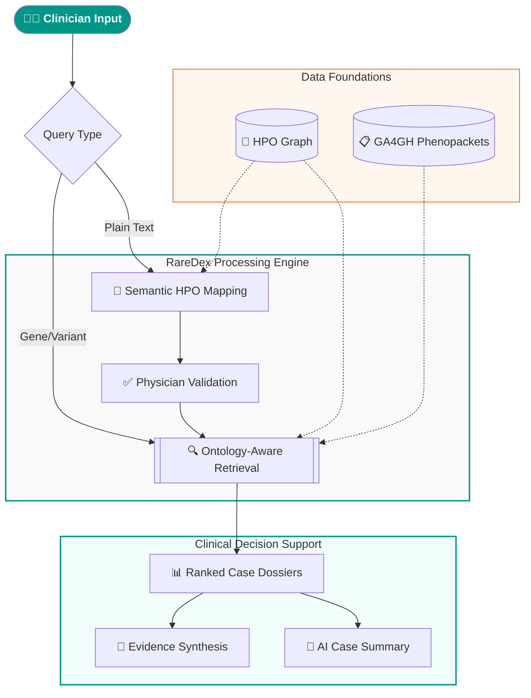

## *"When you hear hoofbeats, think horses, not zebras."*

### 🧬 Rare disease case retrieval for clinical decision support

🏛️ University Medicine Greifswald &nbsp;·&nbsp; Institute of Bioinformatics

---

---

| 🧪 9,688 patient cases | 🦓 643 rare diseases | 🧬 641 genes | 📋 GA4GH Phenopackets |
|:---:|:---:|:---:|:---:|

---

[🔍 Live Platform](https://raredex.nube.uni-greifswald.de/) • [📖 Overview](#overview) • [⚙️ Architecture](#architecture) • [✨ Features](#features) • [📬 Contact](#contact)

---

### 🎯 The Mission

In medicine, the proverb <em>"think horses, not zebras"</em> reminds clinicians to favor common diagnoses. But for the <strong>estimated hundreds of millions of people</strong> worldwide living with a rare disease, the <strong>zebra is the reality</strong>.

Reaching a diagnosis takes an average of <strong>4.8 years</strong>, often involving a diagnostic odyssey of misdiagnoses and unnecessary investigations. <strong>RareDex</strong> bridges this gap — giving clinicians an infrastructure to systematically compare patient phenotypes against thousands of documented cases, and surface what happened next.

---

### 📖 Overview

<strong>RareDex</strong> is a phenotype-driven rare disease case retrieval system built for clinical research. Given a patient's symptoms, it searches a corpus of <strong>9,688 structured rare disease cases</strong> across <strong>643 diseases</strong> to surface phenotypically similar prior cases — together with their pathogenic variants, management evidence, and clinical trial data.

Built on the <a href="https://github.com/monarch-initiative/phenopacket-store">GA4GH Phenopacket Store</a>, a curated collection of structured rare disease cases encoded in the <a href="https://phenopackets.org">GA4GH Phenopacket schema</a>.

---

#### ⚙️ Architecture

